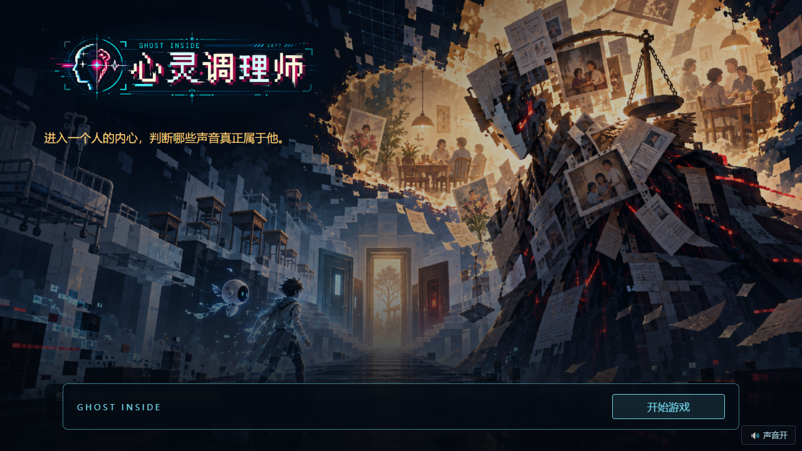
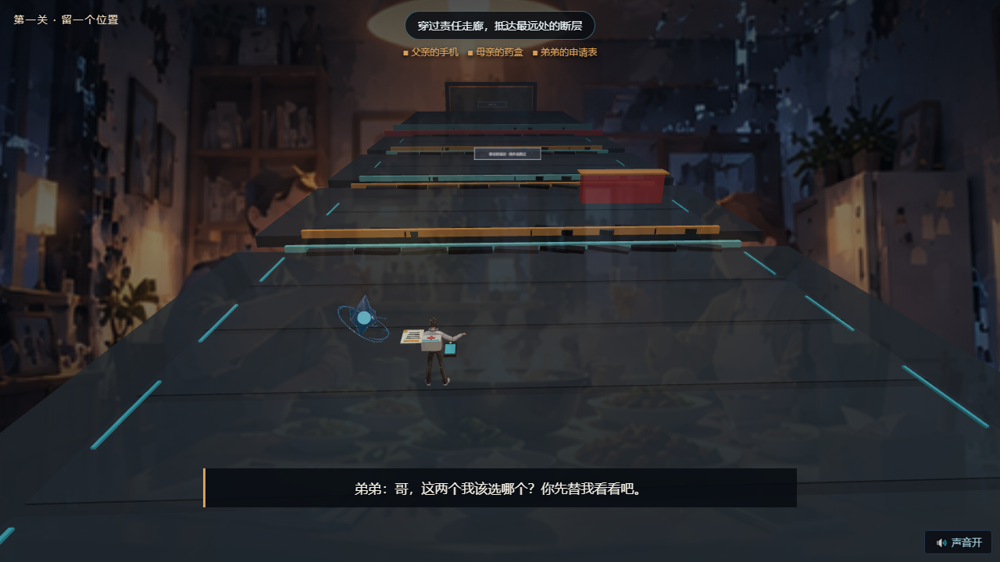
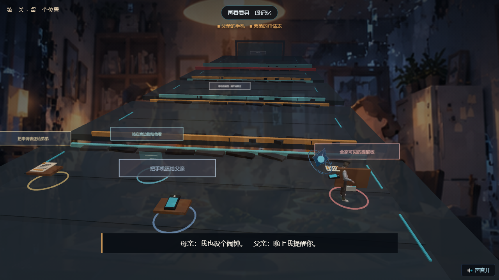
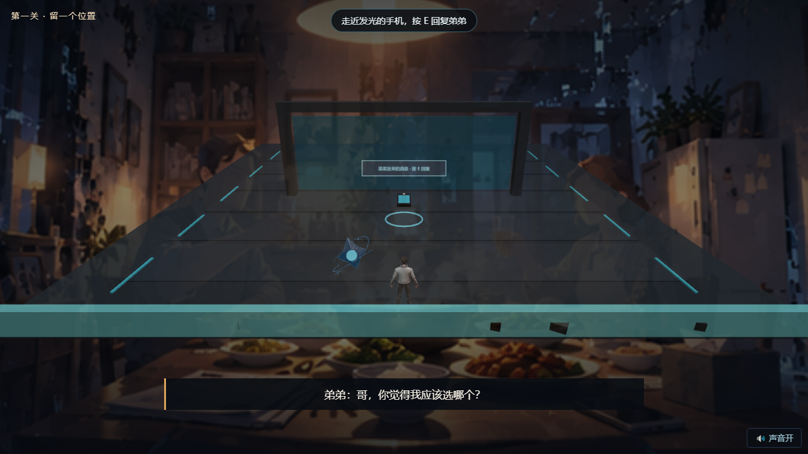
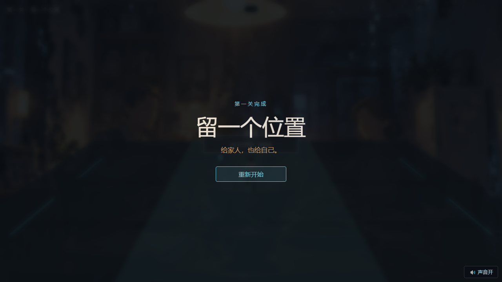

# Ghost Inside · Web Demo

《Ghost Inside · 心灵调理师》第一关 **《留一个位置》** 的可玩 Web Demo（V0.6，2026-10-06）。

一款 5–7 分钟的 3D 叙事游戏：你将扮演 **林澈**，替家人拿起三件事，身体逐渐变重；第一次无法跨过断层；在三段记忆里把责任还到合适的位置；发现被压住的异地调动通知；把自己的选择留下之后，再次越过同一处断层。

| 开始 | 负重 | 记忆解谜 | 最终跳跃 | 通关 |
|---|---|---|---|---|
|  |  |  |  |  |

## 快速开始

```bash
cd game/web
npm install
npm start        # 打开 http://127.0.0.1:4173/
```

开发与构建：

```bash
npm run dev      # Vite 开发服务器
npm run build    # 产出 game/web/dist/
```

无需后端服务、无需数据库、无外部 AI 依赖，本地即可完整通关。

## 操作

- **WASD / 方向键**：移动
- **Space**：跳跃
- **E / Enter**：拿起、放下、互动

## 玩法与设计原则

- 核心机制：**负重** —— 每替家人拿起一件事，角色移动与跳跃能力都会下降；放下后恢复。
- 三段记忆场景（餐桌 / 收集者 / 责任归位）中把每件事还给真正该负责的人。
- 发现被三件事压住的「异地调动通知」，并写下自己的选择。
- **没有答题、没有证据面板、没有心理评分**；失败不会死亡，物品不会丢失，同一处断层的三次结果构成完整叙事。

## 技术栈

- [Three.js](https://threejs.org/) 0.186 + [Vite](https://vitejs.dev/) 8，纯前端单页应用
- 角色与幽灵使用 glTF 2.0 模型（绑定骨骼的林澈、Ghost）
- WebAudio 合成音效，无音频文件依赖

## 项目结构

```
game/web/
├── public/assets/        # 3D 模型（lin-che-rigged.glb、ghost.glb）、UI 主视觉
├── src/
│   ├── scenes/           # 场景：花园（教学+断层）、收集者、责任记忆
│   ├── game/             # 状态机、游戏时钟、输入、角色视觉
│   ├── ui/               # 叙事文本、结局陈述
│   ├── render/           # Three.js 渲染器
│   └── audio/            # WebAudio 音景
├── docs/screenshots/     # 完整流程截图
└── index.html
```

## 相关仓库

- 早期 Godot 4.7 原型（案例001·白色走廊）：[Ghost-Inside](https://github.com/asb999/Ghost-Inside)
